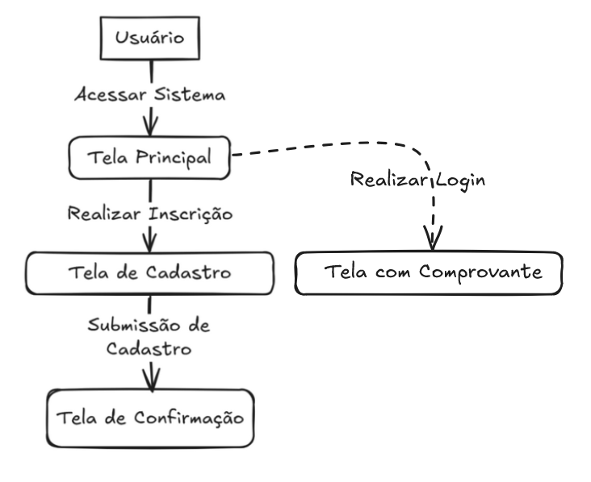

# Sistema de Inscrição e Seleção Trilhas Inova

 <!-- Opcional: adicione badges relevantes -->

---

## **1. Objetivo do Sistema**  
Desenvolver um sistema de inscrição digital **eficiente, seguro e intuitivo** para:  
- Automatizar e simplificar o registro de novos usuários.  
- Reduzir erros e retrabalho.  
- Acelerar o tempo de conclusão das inscrições.  
- Garantir integridade e segurança dos dados cadastrados.  
- Oferecer uma experiência clara e acessível para todos os usuários.  

---

## **2. Problema a Ser Resolvido**  

### **Contexto Atual**  
- Processo de inscrição **manual, fragmentado** e dependente de múltiplas plataformas.  
- Falta de padronização na coleta de dados.  
- Ausência de validação em tempo real de informações.  
- Dificuldades gerais para realização da inscrição (ex.: complexidade, falta de clareza).  

### **Impactos Negativos**  
- Atrasos na conclusão dos processos.  
- Frustração dos usuários devido a problemas técnicos ou complexidade.  
- Inconsistências nos dados coletados.  

---

## **3. Público-Alvo**  

### **Usuários Finais**  
- **Grupo:** Estudantes, profissionais e participantes de programas/eventos.  
- **Perfil:**  
  - Idade: Não restritiva (foco em acessibilidade).  
  - Nível de familiaridade com tecnologia: Desde básico até avançado.  

### **Administradores**  
- Responsáveis por:  
  - Gerenciar inscrições.  
  - Validar dados e documentos.  
  - Gerar relatórios e acompanhar métricas.  

---

## **4. Funcionalidades Principais**  

### **Página Inicial**  
- Logo da **Trilhas Inova**.  
- Botão de redirecionamento para o formulário de inscrição.  

### **Formulário de Inscrição**  
- Campos com máscaras para:  
  - CPF (`___.___.___-__`).  
  - Telefone (`(DDD) _____-____`).  
- Upload de documentos em formato **PDF** (ex.: RG, comprovante de residência).  
- Consulta automática de endereço via **CEP** (integração com API dos Correios).  

---

## **5. Fluxo de Inscrição**  

1. **Acesso à Plataforma**  
   - Usuário entra na página inicial e clica no botão de inscrição.  

2. **Cadastro Básico**  
   - Preenchimento de dados iniciais:  
     - Nome completo.  
     - CPF (com máscara).  
     - E-mail e telefone (com máscara).  

3. **Validação de Documentos**  
   - Upload de documentos obrigatórios (ex.: RG, comprovante de residência).  

4. **Formulário Completo**  
   - Preenchimento de informações adicionais (ex.: endereço via CEP, histórico acadêmico).  

5. **Confirmação e Finalização**  
   - Revisão dos dados.  
   - Envio do formulário.  
   - Recebimento de e-mail de confirmação com instruções.  

    

---

## **6. Tecnologias Utilizadas**  
  
  

---

## **7. Como Contribuir**  
1. Faça um fork deste repositório.  
2. Crie uma branch com sua feature: `git checkout -b feature/nome-da-feature`.  
3. Envie um pull request detalhando suas alterações.  

---

## **Licença**  
Este projeto está licenciado sob a **Licença MIT**. Veja [LICENSE](LICENSE) para mais detalhes.  